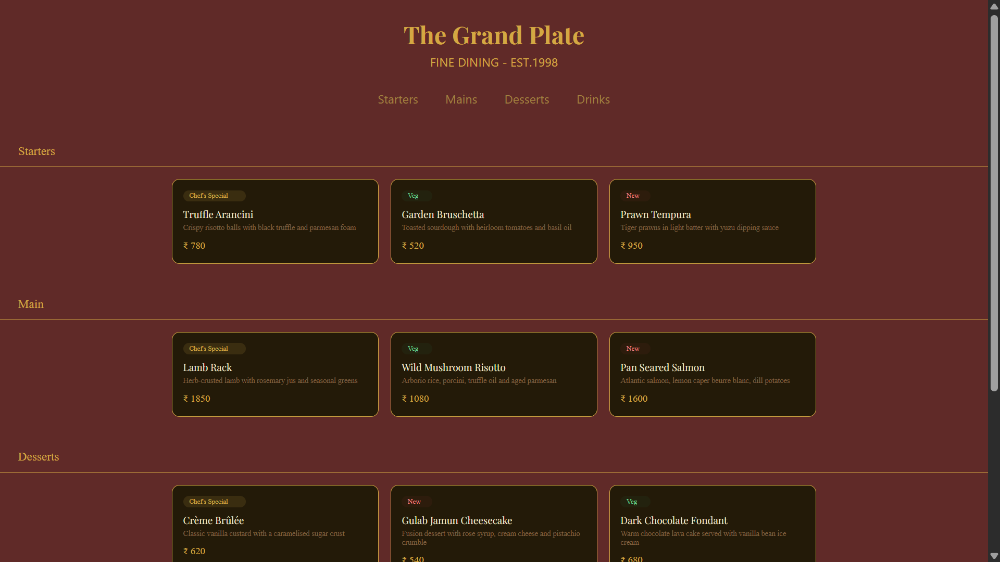
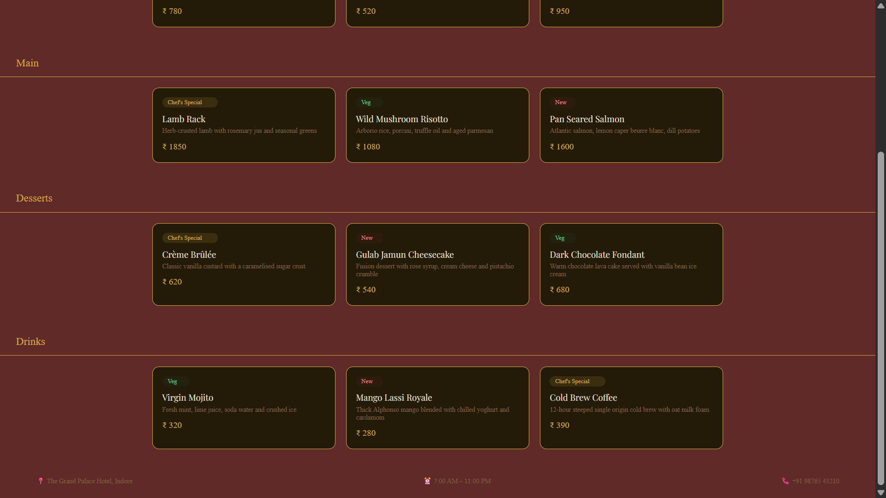

# 🍽️ The Grand Plate — Hotel Restaurant Menu

A fine dining restaurant menu page built with pure HTML and CSS, designed as part of my Full Stack Web Development learning journey.

---

## 🌟 Features

* Elegant dark gold color scheme inspired by luxury hospitality
* Responsive card layout using CSS Grid (`auto-fit` + `minmax`)
* Smooth scroll navigation — click a tab to jump to any section
* Four menu sections: Starters, Mains, Desserts, and Drinks
* Dish cards with name, description, price, and category badges (Chef's Special / Veg / New)
* Hover animation on cards with lift effect and gold glow shadow
* Google Font (Playfair Display) for a premium typographic feel
* Fully responsive — works on mobile and desktop

---

## 🛠️ Technologies Used

* HTML5 — semantic structure, anchor links, section IDs
* CSS3 — Flexbox, CSS Grid, transitions, hover effects, Google Fonts

---

## 📚 Learning Outcomes

* Structuring a real-world multi-section webpage with HTML
* Building responsive card layouts using CSS Grid
* Using anchor links (`href="#id"`) for in-page navigation
* Applying `scroll-behavior: smooth` and `scroll-padding-top` for polished UX
* Styling interactive elements with `:hover` and `transition`
* Understanding the difference between `margin` and `padding` in layout
* Writing clean, commented, and well-organised HTML & CSS

---

## 📸 Screenshot

> Add a screenshot of your project here
>
> 




---

## 🚀 Live Demo

> Add your GitHub Pages link here
> [View Live →](https://your-username.github.io/the-grand-plate)

---

## 📁 Project Structure

```
the-grand-plate/
├── index.html       # Main HTML file with all sections
├── style.css        # All styling, layout, and animations
└── README.md        # Project documentation
```

---

## 🙋 Author

**Ashu**
B.Tech Computer Science Student | Aspiring Software Engineer
Building projects to become internship-ready.
